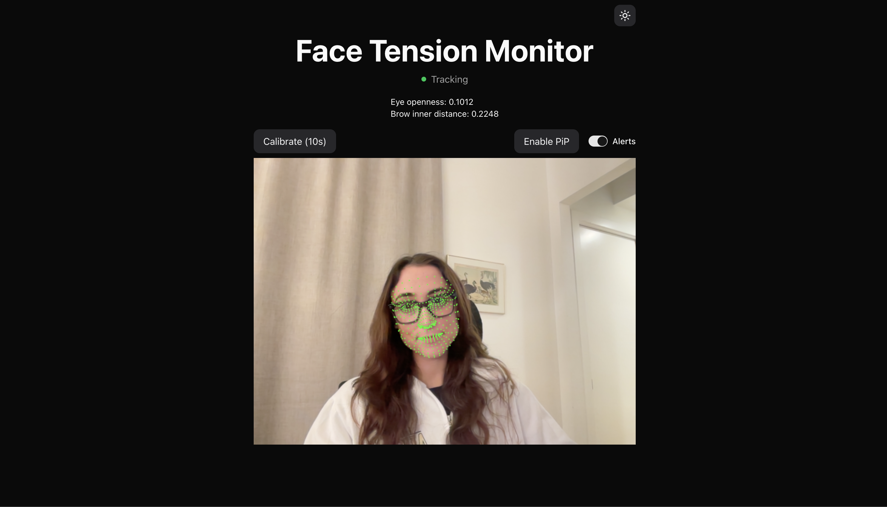

# Facial Tension Detector

A work-in-progress web app exploring whether real-time awareness of facial tension can help reduce migraine frequency. 

This is a personal tool and a learning project, and I’m documenting the build as it evolves.

## What it does (right now)

- Tracks facial landmarks locally in the browser  
- Computes some basic tension signals that are migraine triggers for me  
- Calibrates a personal neutral baseline  
- Plays a chime and fires a browser alert when sustained tension is detected  
  (currently buggy and prone to false positives like smiling, and only tested on Google Chrome and Safari)

## What it’s moving toward

- Smarter alerting that’s helpful, not annoying  
- Configurable thresholds for duration and intensity  
- Better handling of movement and normal expressions  

## Notes

- This is my first real dive into computer vision, so lots of beginner learning here 
- Not a medical tool (duh)
- Expect rough edges and bugs

## Screenshots

